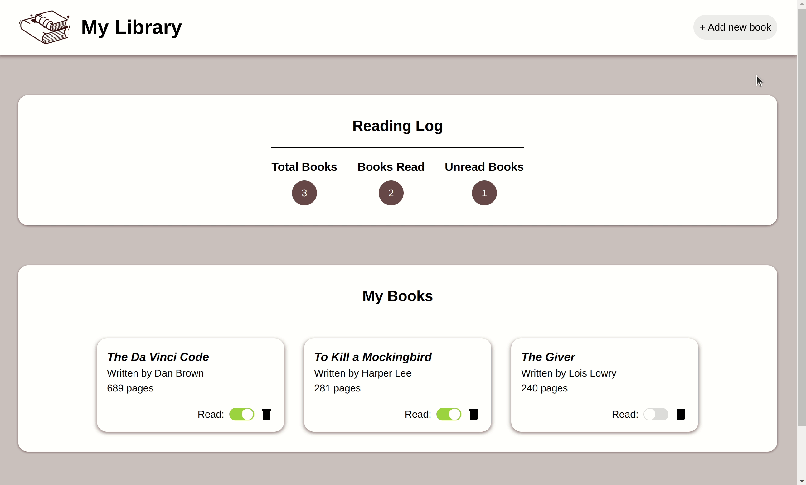

# Library

https://hannahkim313.github.io/library/

## Project Summary

This project exercise, created by The Odin Project, is small library application
that both logs and tracks which books the user has or has not read. The purpose
of this project is to demonstrate the use of objects and prototypes combined
with a previous knowledge of DOM manipulation.

## In Action

### Features Overview

### Responsiveness

## Credits

* [Book logo](https://www.freepik.com/free-vector/book-notebook-doodle-hand-drawn-icon-symbol-education-concept_20338853.htm#query=book%20logo&position=4&from_view=keyword#position=4&query=book%20logo) by [mamewmy](https://www.freepik.com/author/mamewmy) at Freepik

* Design icons provided by [Material Design Icons](https://materialdesignicons.com/)